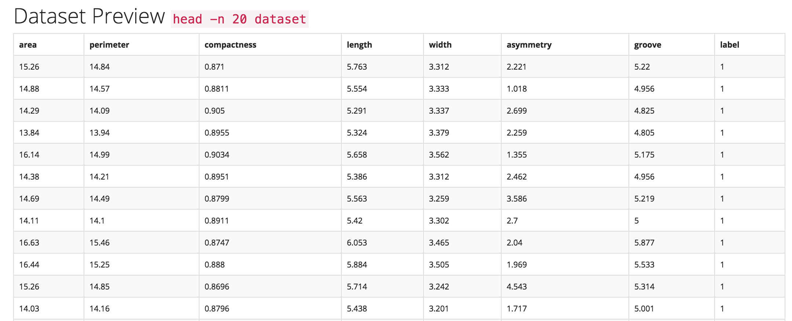

# Automated Analysis

## Overview    

Trinket is designed to mirror what experienced data scientists do when they take their first few passes through a new dataset by intelligently automating large portions of the wrangling and analysis/exploration phases of the data science pipeline, integrating them into the initial ingestion or uploading phase.

## Architecture    

The auto-analysis and text parsing features of Trinket are written in Python. They work by scanning columns of uploaded data and using `numpy`, `unicodecsv`, one-dimensional kernel density estimates, standard analyses of variance mechanisms and hypothesis testing (KDEs, ANOVAs).



This enables Trinket to do type identification, e.g. to identify and differentiate: discrete integers, floats, text data, normal distributions, classes, outliers, and errors. To perform this analysis quickly and accurately during the data ingestion process, Trinket includes a rules-based system trained from previously annotated data sets and coupled with heuristic rules determined in discussions with a range of experienced data scientists.

## Mechanics

Auto-analysis works by assigning each column/feature a data type (`dtype` in the parlance of NumPy and Pandas), e.g. categorical, numeric, real, integer, etc. These types must be automatically inferred from the dataset.

The auto-analysis method takes as input a file-like object and generic keyword arguments and returns as output a tuple/list whose length is the (maximum) number of columns in the dataset, and whose values contain the datatype of each column, ordered by column index.


_Questions to answer:_

- How do other libraries like `pandas` and `messytables` do this?    
Pandas computes [histograms](https://github.com/pydata/pandas/blob/master/pandas/core/algorithms.py#L250), looks for the [min](https://github.com/pydata/pandas/blob/master/pandas/core/algorithms.py#L537) and [max](https://github.com/pydata/pandas/blob/master/pandas/core/algorithms.py#L556) values of a column, samples [quantiles](https://github.com/pydata/pandas/blob/master/pandas/core/algorithms.py#L410), and counts [unique values](https://github.com/pydata/pandas/blob/master/pandas/core/algorithms.py#L55).

- Do you have to go through the whole dataset to make a decision?    
Yes and no - decide based on how big the dataset is. The below strategy builds a sample from 50 non-empty rows for each column, as well as the rows with the longest and shortest lengths. For larger datasets, maybe sample 10%. For extremely large datasets, 1% might be enough.

- Can we use a sampling approach to reading the data?
Naive method (assumes straightforward densities):

```python
for each col in fileTypeObject:
    find mx # row with the longest value
    find mn # row with the shortest value
    find nonNaN # first 50 non-empty rows using ndarray.nonzero()
    sampleArray = nd.array(mn, mx, nonNaN)    
```    

- Is there a certain density of data required to make a decision?    
This is a good question - some libraries build histograms for each column to examine densities. See the [`pandas` method for histograms](https://github.com/pydata/pandas/blob/master/pandas/core/algorithms.py#L250).
TODO: look into thresholds

- What types are we looking for?
__string__, __datetime__, __float__, __integer__, __boolean__
See also [`messytables` types](https://github.com/okfn/messytables/blob/master/messytables/types.py).

Attempt parsing from broadest type to narrowest:

```python
for val in colSample:
    if val.dtype.type is np.string_:
        colType = colType.astype('Sn') # where n is the max length value in col
    elif val.dtype.type is np.datetime64:
        colType = colType.astype('datetime64') # this is new & experimental in NumPy 1.7.0   
    elif val.dtype.type is np.float_:
        colType = colType.astype('float64')      
    elif val.dtype.type is np.int_:
        colType = colType.astype('int64')   
    elif val.dtype.type is np.bool_:
        colType = colType.astype('bool')   
    else:
        # do something else
        # what about unicode and complex types?
```

- What does column-major mean for Trinket?    
Use [`transpose`](http://docs.scipy.org/doc/numpy-1.10.1/reference/generated/numpy.ndarray.T.html) and/or [`reshape`](http://docs.scipy.org/doc/numpy-1.10.1/reference/generated/numpy.reshape.html) from `numpy`.

- Can we automatically detect delimiters and quote characters? (e.g. ; vs ,)    
See `messytables` [method for delimiter detection](https://github.com/okfn/messytables/blob/master/messytables/commas.py).

- How do we detect if there is a header row or not?    
See `messytables` [method for header detection](https://github.com/okfn/messytables/blob/7e4f12abef257a4d70a8020e0d024df6fbb02976/messytables/headers.py).

- How lightweight/heavyweight must this be?   
Look into making more lightweight using regular expressions & hard-coded rules (see [Brill tagging](https://en.wikipedia.org/wiki/Brill_tagger)).

## Sources

[Datatypes in Python - 2.7](https://docs.python.org/2/library/datatypes.html)

[Datatypes in Python - 3.5](https://docs.python.org/3.5/library/datatypes.html)

[Numpy - dtypes](http://docs.scipy.org/doc/numpy/reference/arrays.dtypes.html)

[UnicodeCSV](https://github.com/jdunck/python-unicodecsv/blob/master/README.rst)

[Pandas](http://pandas.pydata.org/)

[MessyTables](https://messytables.readthedocs.org/en/latest/)

[Dataproxy](https://github.com/okfn/dataproxy)

[Algorithms for Type Guessing - Stackoverflow](http://stackoverflow.com/questions/6824862/data-type-recognition-guessing-of-csv-data-in-python)

[Python Libraries for Type Guessing - Stackoverflow](http://stackoverflow.com/questions/3098337/method-for-guessing-type-of-data-represented-currently-represented-as-strings-in)
