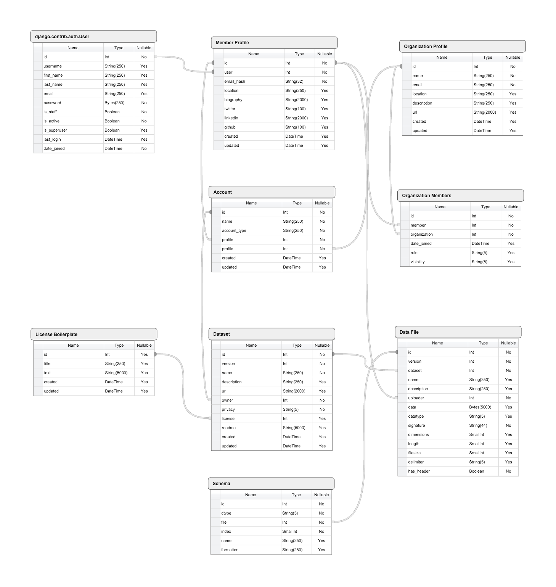

# Development Documentation

Welcome to the development documentation for Trinket. For more on contributing to Trinket, please see [About Trinket](about.md), which discusses how to contribute, the development board for issues, the way that the project is set up, and includes a list of contributors and the changelog. This documentation is intended to provide guidelines to getting started with and setting up Trinket, as well as provide notes for how to add features to Trinket.

## Database Schema

The proposed Trinket database schema is as follows:

The database is described by Django models and is managed and updated through the use of Django migrations. For more details, and a complete look at the database, please review the code for those models. To get a current snapshot of the structure of the database, I recommend using [ERAlchemy](https://github.com/Alexis-benoist/eralchemy), which will generate a diagram or markdown file describing the schema. 
