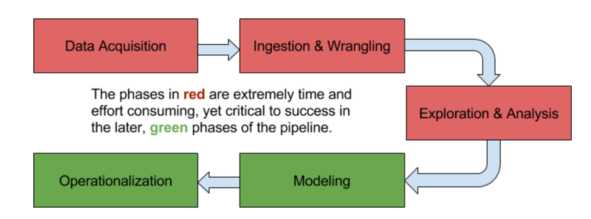

# Welcome to DDL Cultivar!

There is a massive amount of potential value, both commercial and societal, in the data that is being generated today, but the shortage of both knowledgeable data scientists and quality tools to extract insights from these large, complex data sets is preventing advancements in society that could be achieved faster. A better understanding of the world around us and the enhanced ability to make good decisions are just the tip of the iceberg of what more efficient data science processes could allow us to accomplish as a society, and with Cultivar, we hope to be able to expand the abilities of data scientists and other analytical professionals so that we can achieve those societal advancements on a larger scale.

In the last few years, data science and analytical functions have played an increasingly important role in the operations of a growing number of companies, and we see this trend continuing to grow for the foreseeable future. Today’s top companies have significant data science processes in place that continually optimize their offerings and improve their products. The competitive edge that these processes afford companies will drive increased competition for both analytical professionals and for tools to help them generate value from data.

Data science consists of a conglomeration of methods from previously existing fields like statistics and computer science, combined with new practices for processing the large amounts of data that are being generated today. It is a very broad technological field, which gives it the properties of being applicable to almost every other discipline and of there constantly being new advancements in some parts of the field. This presents a substantial economic opportunity for companies that cater to the needs of data scientists and the companies for whom they work.

In order for data to be valuable, it needs to go through a refinement process. We call this process the data science pipeline, and Cultivar aims to improve and streamline the most time consuming phases of the pipeline so that data scientists can be as productive as possible and more quickly build valuable solutions for their organizations.

Cultivar is an integrated data management, exploration, and visualization solution aimed at enhancing the experimental workflow of the data scientist.

Cultivar offers:   

1. [Visual analytics](visual_analysis.md) features to enable more effective separability analysis of multidimensional and unstructured data.   

2. [Automated data “touch”](auto_analysis.md) (e.g. parsing, standardization, normalization, cleaning, wrangling) to accelerate analysis.      

3. State-of-the-art [version control and provenance](version_control.md) for dataset management.    

Cultivar is a dataset management, analysis and visualization tool that is being built as part of the DDL Multidimensional Visualization Research Lab. See: [Parallel Coordinates](http://homes.cs.washington.edu/~jheer//files/zoo/ex/stats/parallel.html) for more on the types of visualizations we're experimenting with.
