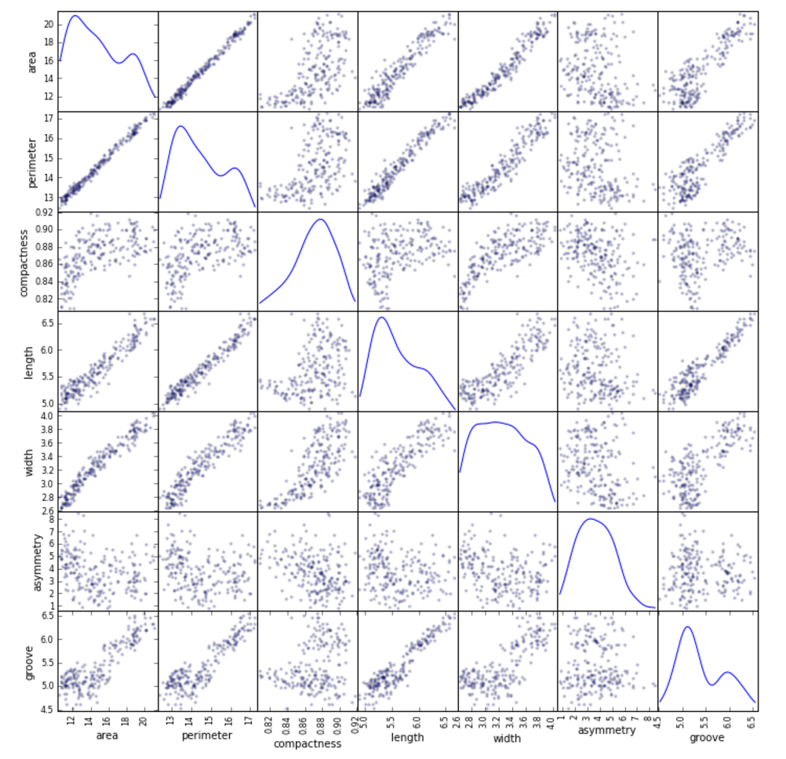
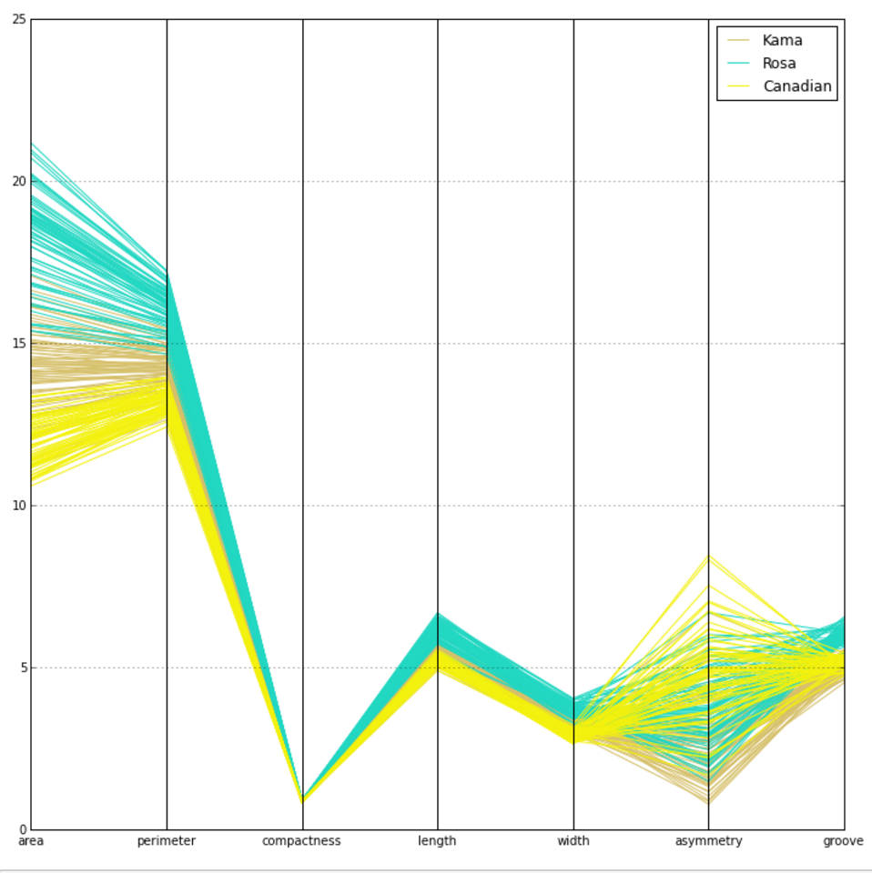
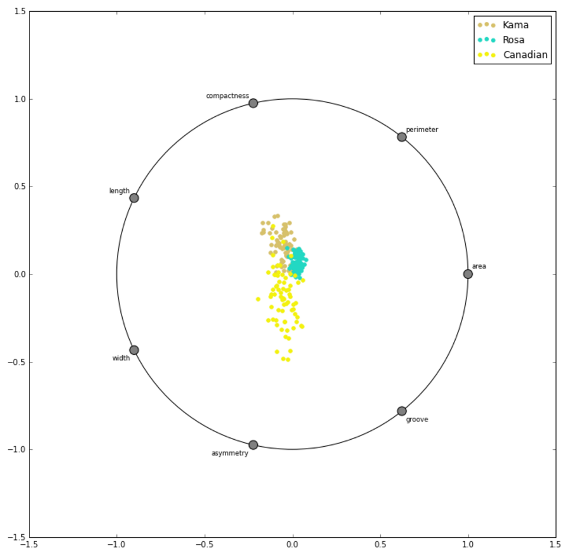

# Visual Analysis

## Overview     

Separability analysis is critical to the machine learning phase in the data science pipeline, but it becomes increasingly difficult as dimensionality increases. High dimensional data is particularly difficult to explore because most people cannot visualize beyond two- or three-dimensions. Even lower dimensional data can be tedious to visualize because it still requires writing a substantial amount of code, regardless of the programming language one uses.

Trinket's visual analysis tools are designed to enable the user to interact with visualizations to help them understand the data. In particular, Trinket aims to deliver visual analytics features that enable separability analysis for multidimensional and unstructured data.

## Architecture    

Scatter matrices, parallel coordinates, and radviz are three promising visual approaches to separability analysis on high-dimensional data.

The underlying architecture of the visualization tools is an implementation of hierarchical (agglomerative) clustering and brushing as described in Elmqvist and Fekete (2010) and Fua, Ward and Rundensteiner (1999) using `scikit-learn`. This clustering approach results in distance metrics necessary to do instance identification, and provides “cuts” that can be viewed at multiple different levels using brushing. Trinket also provides a two-dimensional rank-by-feature framework as described by Seo and Schneiderman (2004, 2005, 2006), including color-coded scatterplot matrices to identify linear, quadratic, Pearson, and Spearman relationships between pairs of variables, and tools to facilitate separability analysis, such as radial visualization, dendrograms, and parallel coordinates as described in Wegman (1990), Fua, Ward, and Rundensteiner (1999), and Inselberg (2004).

## References    

Elmqvist, N., & Fekete, J.-D. (2010). Hierarchical aggregation for information visualization: Overview, techniques, and design guidelines. Visualization and Computer Graphics, IEEE Transactions on, 16(3), 439–454.

Fua, Y., Ward, M., & Rundensteiner, E. (1999). Hierarchical parallel coordinates for exploration of large datasets. Proceedings of the conference on Visualization '99: Celebrating ten years. IEEE Computer Society Press.

Seo, J., & Shneiderman, B. (2004). A rank-by-feature framework for unsupervised multidimensional data exploration using low dimensional projections. In Information Visualization, INFOVIS 2004. IEEE Symposium on (pp. 65–72).

Seo, J., & Shneiderman, B. (2005). A rank-by-feature framework for interactive exploration of multidimensional data. Information Visualization, 4(2), 96–113.

Seo, J., & Shneiderman, B. (2006). Knowledge discovery in high-dimensional data: Case studies and a user survey for the rank-by-feature framework. Visualization and Computer Graphics, IEEE Transactions on,12(3), 311–322.

Wegman, E. (1990). Hyperdimensional data analysis using parallel coordinates. Journal of the American Statistical Association, Vol. 85, No. 411, pp. 664-675
