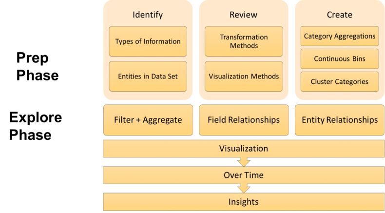

# Cultivar

## Human Machine Collaboration

Over the last several years, Python developers interested in data science and analytics have acquired a variety of tools and libraries that aim to facilitate analytical processes. Libraries such as Pandas, Statsmodels, Scikit-learn, Matplotlib, Seaborn, and Yellowbrick have made tasks such as data wrangling, statistical modeling, machine learning, and data visualization much quicker and easier. They have accomplished this by automating and abstracting away some of the more tedious, repetitive processes involved with analyzing and modeling data.

Over the next few years, we are sure to witness the introduction of new tools that are increasingly intelligent and have the ability to automate more complex analytical processes. However, as we begin using these tools (and developing new ones), we should strongly consider the level of automation that is most appropriate for each case. Some analytical processes are technically difficult to automate, and therefore require large degrees of human steering. Others are relatively easy to automate but perhaps should not be due to the unpredictability of results or outputs requiring a level of compassionate decision-making that machines simply don’t possess. Such processes would benefit greatly from the collaboration between automated machine tasks and uniquely human ones. After all, it is often systems that utilize a combination of both human and machine intelligence that achieve better results than either could on their own.

Below is a link to the slides from Tony Ojeda's presentation on Human Machine Collaboration, where you can view the steps required for some of the stages in the framework. 

* [Human Machine Collaboration for Improved Analytical Processes Slides](https://www.slideshare.net/ojedatony1616/human-machine-collaboration-for-improved-analytical-processes)

## Data Exploration Framework

Exploratory data analysis (EDA) is an important pillar of data science, a critical step required to complete every project regardless of the domain or the type of data you are working with. It is exploratory analysis that gives us a sense of what additional work should be performed to quantify and extract insights from our data. It also informs us as to what the end product of our analytical process should be. Yet, we've often seen people grasping at straws when it comes to exploring their data and trying to find insights.

Having witnessed the lack of structure in conventional approaches, we decided to document our own processes in an attempt to come up with a framework for data exploration. We want the resulting framework to provide a more structured path to insight discovery: one that allows us to view insight discovery as a problem, break that problem down into manageable components, and then start working toward a solution.

The following blogs go into the framework in more detail:

* [Data Exploration with Python, Part 1](http://blog.districtdatalabs.com/data-exploration-with-python-1)

* [Data Exploration with Python, Part 2](http://blog.districtdatalabs.com/data-exploration-with-python-2)

* [Data Exploration with Python, Part 3](http://blog.districtdatalabs.com/data-exploration-with-python-3)

## PyCon Sprints

During the PyCon sprints, we would like to create a series of user studies applying this framework to data sets and demonstrating ways that human machine collaboration could be incorporated into the framework's steps. 

1. Find a dataset you like that you think would be a good example dataset to use.

2. Use the steps from the Exploratory Data Analysis Framework on this dataset. Any code created, results, and any insights or comments should be captured in a Jupyter notebook and submitted to the [examples directory](https://github.com/DistrictDataLabs/cultivar/tree/pycon/examples) in the pycon branch of the Cultivar repo. If you don't have Jupyter installed on your machine or know how to use it, you can refer to the following documentation:
  [https://jupyter.readthedocs.io/en/latest/install.html](https://jupyter.readthedocs.io/en/latest/install.html)

3. Each of these efforts will serve to provide examples of how to use the framework to explore and analyze an example dataset in a human-machine collaborative fashion. Our hope is to be able to incorporate findings from the user study into Cultivar when the time comes to develop the exploratory analysis functionality for the application. 

